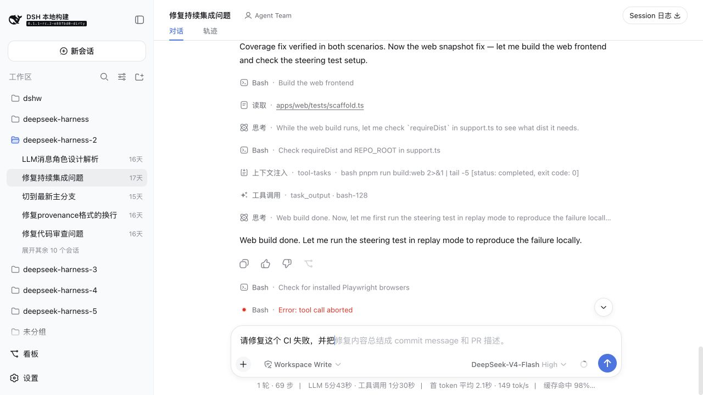

# dsh-composer-completion

> 个人开源项目，非 DeepSeek 官方产品。

`dsh-composer-completion` 是一个独立的 DeepSeek Harness 插件，为 Web 主输入框提供类似代码补全的灰字续写。插件使用独立的 Flash 模型生成建议；按 `Tab` 接受，按 `Esc` 忽略。



## 功能

- 在用户停顿后显示灰字补全，当前输入为空时也可以建议下一段输入
- 只补全主输入框文本，不参与 `/` 指令或 `@` 引用菜单
- 使用当前会话中的 User 与 Assistant 消息作为上下文，并把持续变化的草稿放在提示词末尾以提高前缀缓存命中率
- 新输入与已有补全一致时复用结果；输入偏离时取消旧请求
- 模型可以明确返回“不补全”，不会为了展示灰字而强行生成内容
- 不修改 DeepSeek Harness 源码，也不会把补全请求写入主会话记录

## 安装

### 前置条件

- 已配置可用模型 Provider 的 DeepSeek Harness

### 步骤

```sh
git clone https://github.com/kermanx/dsh-composer-completion.git
cd dsh-composer-completion
dsh plugin --profile web add "$PWD/packages/composer-completion"
```

停止并重新运行 `dsh web`，然后刷新页面。客户端插件在 Web 服务启动时组装，首次安装后必须重启。

## 使用

将光标放在主输入框末尾并短暂停顿。出现灰字后：

- `Tab`：接受当前补全
- `Esc`：隐藏当前补全
- 继续输入：匹配时逐字复用补全；不匹配时重新请求

补全只会在输入框处于普通文本状态、光标位于末尾、没有 `/` 或 `@` 菜单、且主 Agent 未运行时出现。

## 配置

默认使用 `deepseek-official` Provider 的 `deepseek-v4-flash`，输出上限为 64 tokens。可以在 Web profile 的 `cordis.patch.yml` 中覆盖配置：

```yaml
- id: composer-completion
  config:
    provider: deepseek-official
    model: deepseek-v4-flash
    maxOutputTokens: 64
    debounceMs: 250
```

修改配置后需要重启 `dsh web`。

## 开发

仓库提交了可直接安装的构建产物。只有修改源码时才需要在同一上级目录准备名为 `deepseek-harness-4` 的 DeepSeek Harness checkout：

```sh
pnpm install
pnpm build
```
